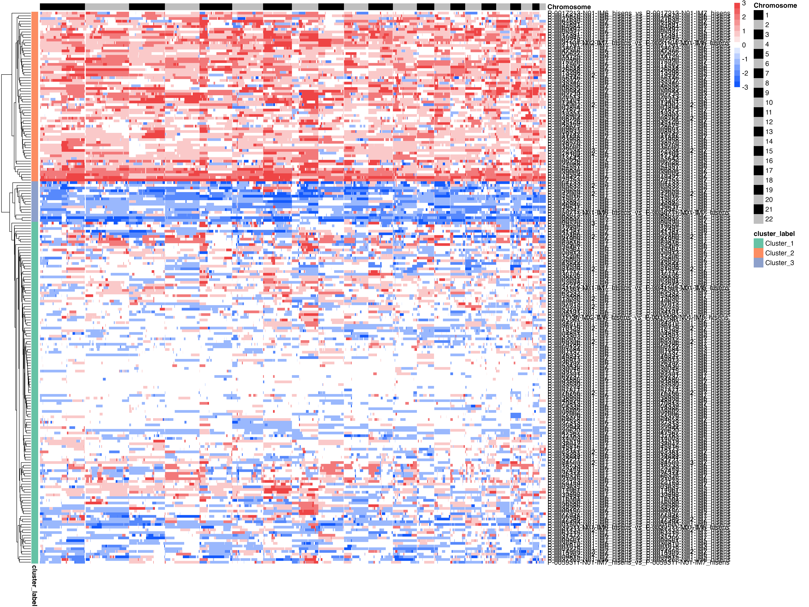

# CompareTCN

Functions for analyzing and comparing Total Copy Number (TCN) profiles between paired and unpaired cancer sample cohorts.

## Overview

CompareTCN provides tools for:
- **Paired cohort analysis**: Compare matched samples (e.g., primary vs. metastatic tumors from the same patients)
- **Unpaired cohort analysis**: Compare independent cohorts of different sizes
- **Statistical testing**: Wilcoxon signed-rank test for paired data, Mann-Whitney U test for unpaired data
- **Visualization**: Heatmaps, volcano plots, Manhattan plots, and individual comparison plots
- **Gene annotation**: Integration with Biomart and OncoKB databases

## Features

### Paired Cohort Analysis
- Compares matched sample pairs (e.g., primary tumor vs. brain metastasis)
- Uses **Wilcoxon signed-rank test** for proper paired statistical testing
- Generates pairwise comparison plots showing TCN differences
- Creates summary statistics for each patient pair

### Unpaired Cohort Analysis  
- Compares two independent cohorts of potentially different sizes
- Uses **Mann-Whitney U test** for independent group comparisons
- Analyzes average TCN differences between cohorts
- Suitable for comparing different cancer types or treatment groups

## Visualizations

### Pairwise Comparison Plots
*Individual comparison showing unique and shared TCN segments between paired samples*

<!--  -->

### Lollipop Plots
*Distribution of pairwise differences across the compared cohort*

<!--  -->

### Average TCN Difference Plot
*Genome-wide view of average TCN differences with oncogenic gene annotations*

<!--  -->

### Heatmaps
*Clustered heatmap showing TCN differences across genomic bins and sample comparisons*

<!--  -->

### Volcano Plots
*Volcano plot highlighting statistically significant genomic regions with gene annotations*

<!--  -->

### Manhattan Plots
*Manhattan plot displaying -log10(adjusted p-values) across chromosomes 1-22*

<!--  -->


## Installation

```r
# Install required packages
install.packages(c("tidyverse", "ggtext", "ggrepel", "tidyheatmaps"))

# Bioconductor packages
if (!require("BiocManager", quietly = TRUE))
    install.packages("BiocManager")
BiocManager::install(c("GenomicRanges", "plyranges"))

# Development version of tidyheatmaps
devtools::install_github("stemangiola/tidyheatmaps")
```
## Input Data Requirements

### CNCF File
Tab-separated file with columns:
- `ID`: Sample identifier
- `chrom`: Chromosome number (1-22)
- `loc.start`: Segment start position
- `loc.end`: Segment end position  
- `tcn`: Total copy number

### Biomart Annotations
RDS file containing a GRanges object with:
- `hgnc_symbol`: Gene symbols
- `ensembl_gene_id`: Ensembl gene IDs
- Genomic coordinates

### OncoKB CNA Data
Tab-separated file with columns:
- `HUGO_SYMBOL`: Gene symbol
- `ONCOGENIC`: Oncogenic classification

## Advanced Features

### Sample ID Resolution
Flexible sample matching with:
- Exact string matching
- Partial string matching (grep)
- Priority for high-sensitivity samples
- Detailed mapping output

### Gene Annotation Pipeline
1. Genome-wide binning at specified resolution
2. Overlap detection with gene annotations
3. Integration with oncogenic gene databases
4. Multi-gene bin annotation support

### Quality Control
- Sample availability checking
- Overlap validation
- Missing data handling
- Statistical power assessment

## Parameters

| Parameter | Description | Default |
|-----------|-------------|---------|
| `bin_size` | Genomic bin size in base pairs | 1e6 |
| `tcn_diff_threshold` | Threshold for calling significant differences | 1 |
| `exact_match` | Use exact sample ID matching | TRUE |
| `prefer_hisens` | Prefer high-sensitivity samples when multiple matches | TRUE |
| `p_threshold` | P-value threshold for significance | 0.05 |
| `effect_threshold` | Effect size threshold | 1 |


## Example Usage
```r

source("CompareTCN_functions.R")

# Define your paired cohorts using names from the ID column of the cncf FACETS file or just sample 
cohort_1 <- c("P-001-Primary", "P-002-Primary", "P-003-Primary")
cohort_2 <- c("P-001-Metastasis", "P-002-Metastasis", "P-003-Metastasis")

# Run paired analysis
generate_paired_cohort_analysis(
  cncf_path = "path/to/cncf_data.txt",
  biomart_gr_path = "path/to/biomart_annotations.rds",
  Cohort_1 = cohort_1,
  Cohort_2 = cohort_2,
  out_dir = "results/paired_analysis/",
  oncokb_cnas_path = "path/to/oncokb_cna_data.txt",
  bin_size = 1e6, # Select bin size to split the genome, 
  tcn_diff_threshold = 1, # Threshold to plot labels in the average TCN difference plot.
  exact_match = FALSE,  # Enable partial matching with the ID column in cncf FACETS file.
  prefer_hisens = TRUE # Prefer hisens if multiple matches found.
)
```

## Output Files

### Paired Analysis
- `heatmap.png`: Clustered heatmap of TCN differences
- `heatmap_data.tsv`: Matrix of TCN differences with gene annotations
- `volcano_plot.png`: Statistical significance vs. effect size
- `manhattan_plot.png`: Genome-wide significance plot
- `average_tcn_diff_barplot.png`: Average differences across genome
- `diffPercent_lollipop.png`: Percentage differences per comparison
- `sample_id_mapping.tsv`: Sample ID resolution mapping
- `pairwise_plots/`: Individual comparison plots and data

### Unpaired Analysis (COMING SOON...)
- `cohort_tcn_difference.png`: TCN differences between cohorts
- `heatmap_cohort_comparison.png`: Cohort comparison heatmap
- `combined_bin_data.csv`: Detailed bin-level analysis
- `critical_regions.csv`: Regions exceeding threshold
- `summary_statistics.csv`: Cohort summary statistics

## Statistical Methods

### Paired Analysis
- **Wilcoxon signed-rank test**: Tests if the median of paired differences is significantly different from zero
- **Paired t-test alternative**: Non-parametric test suitable for copy number data
- **FDR correction**: Benjamini-Hochberg correction for multiple testing

### Unpaired Analysis (COMING SOON...)
- **Mann-Whitney U test**: Tests if two independent groups have different distributions
- **Wilcoxon rank-sum test**: Non-parametric alternative to two-sample t-test
- **FDR correction**: Benjamini-Hochberg correction for multiple testing


